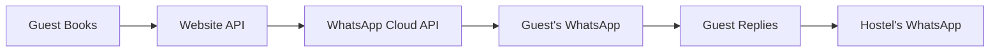

# WhatsApp Business API Setup Guide

> 📱 Complete guide to setting up WhatsApp Business API for Mandioca Hostel automated messaging

---

## Table of Contents

- [[#Overview]]
- [[#Prerequisites]]
- [[#Step 1 - Create Meta Business Account]]
- [[#Step 2 - WhatsApp Business Platform Setup]]
- [[#Step 3 - Get API Credentials]]
- [[#Step 4 - Create Message Templates]]
- [[#Step 5 - Integration with Website]]
- [[#Step 6 - Testing]]
- [[#Message Templates]]
- [[#Automation Triggers]]
- [[#Costs]]
- [[#Troubleshooting]]

---

## Overview

### What We're Building



### Key Features

- ✅ Automatic booking confirmations
- ✅ Check-in reminders (1 day before)
- ✅ Check-out reminders
- ✅ Location and directions
- ✅ Two-way communication

---

## Prerequisites

Before starting, you'll need:

- [ ] Meta Business Account (Facebook)
- [ ] Phone number for WhatsApp Business (can be the hostel's number)
- [ ] Verified business identity
- [ ] Credit card for billing (pay-per-message model)

> ⚠️ **Important**: The phone number CANNOT already be registered on regular WhatsApp or WhatsApp Business App. You may need a new number or migrate the existing one.

---

## Step 1 - Create Meta Business Account

### 1.1 Create Account

1. Go to [business.facebook.com](https://business.facebook.com)
2. Click "Create Account"
3. Enter business details:
   - **Business Name**: Mandioca Hostel
   - **Your Name**: Mariana [Last Name]
   - **Business Email**: info@mandiocahostel.com

### 1.2 Verify Business

1. Go to **Business Settings** → **Security Center**
2. Click "Start Verification"
3. Submit required documents:
   - Business registration document (RUC in Paraguay)
   - Utility bill showing business address
   - Business bank statement

> ⏱️ Verification typically takes 1-3 business days

---

## Step 2 - WhatsApp Business Platform Setup

### 2.1 Access WhatsApp Business Platform

1. Go to [developers.facebook.com](https://developers.facebook.com)
2. Click "My Apps" → "Create App"
3. Select **"Business"** as the app type
4. Enter app details:
   - **App Name**: Mandioca Hostel WhatsApp
   - **Contact Email**: info@mandiocahostel.com
   - **Business Account**: Select your verified business

### 2.2 Add WhatsApp Product

1. In your app dashboard, click "Add Product"
2. Find "WhatsApp" and click "Set Up"
3. Click "Continue"

### 2.3 Add Phone Number

1. Go to **WhatsApp** → **Getting Started**
2. Click "Add phone number"
3. Enter phone number: `+595 XXX XXXXXX` (Paraguay format)
4. Verify via SMS or voice call
5. Enter verification code

### 2.4 Register the Number

After verification, your number will be registered for API use.

> ⚠️ Once registered for API, the number cannot be used in WhatsApp/WhatsApp Business apps simultaneously.

---

## Step 3 - Get API Credentials

### 3.1 Generate Access Token

1. Go to your app's **WhatsApp** → **API Setup**
2. Find "Temporary Access Token" → Click "Generate"
3. Copy the token (valid for 24 hours)

For production, create a **Permanent Token**:
1. Go to **Business Settings** → **System Users**
2. Create a new system user
3. Add to your app
4. Generate token with `whatsapp_business_messaging` permission

### 3.2 Get Phone Number ID

In **API Setup**, find:
- **Phone Number ID**: `XXXXXXXXXXXXXXXXX`
- **WhatsApp Business Account ID**: `XXXXXXXXXXXXXXXXX`

### 3.3 Save Credentials

Add to your `.env.local`:

```env
# WhatsApp Business API
WHATSAPP_ACCESS_TOKEN=your_permanent_access_token
WHATSAPP_PHONE_NUMBER_ID=your_phone_number_id
WHATSAPP_BUSINESS_ACCOUNT_ID=your_business_account_id
WHATSAPP_VERIFY_TOKEN=your_custom_webhook_verify_token
```

---

## Step 4 - Create Message Templates

### Why Templates?

WhatsApp requires pre-approved message templates for business-initiated conversations (non-reply messages).

### 4.1 Create Templates

1. Go to **WhatsApp Manager** → **Message Templates**
2. Click "Create Template"

### Template 1: Booking Confirmation

```
Name: booking_confirmation
Category: UTILITY
Language: English (en)

Header: 🏨 Booking Confirmed!
Body:
Hi {{1}},

Your stay at Mandioca Hostel is confirmed!

📅 Check-in: {{2}}
📅 Check-out: {{3}}
🛏️ Room: {{4}}
💰 Total: ${{5}}

Complete your online check-in here:
{{6}}

See you soon! 🌴

Footer: Mandioca Hostel - Asunción, Paraguay
```

### Template 2: Check-in Reminder

```
Name: checkin_reminder
Category: UTILITY
Language: English (en)

Header: ⏰ Your Stay Starts Tomorrow!
Body:
Hi {{1}},

Just a reminder - your stay begins tomorrow!

📍 Address: Av. Colón 1090, Asunción
⏰ Check-in: 1:00 PM - 11:00 PM

Haven't completed online check-in yet?
{{2}}

Need help? Reply to this message!

Footer: Mandioca Hostel
```

### Template 3: Checkout Reminder

```
Name: checkout_reminder
Category: UTILITY
Language: English (en)

Header: 🧳 Check-out Reminder
Body:
Good morning {{1}}!

Today is your check-out day.

⏰ Please check out by 12:00 PM
📦 Need luggage storage? Just ask!

Thank you for staying with us!
We'd love your feedback: {{2}}

Safe travels! 🌴

Footer: Mandioca Hostel
```

### Template 4: Welcome (After Check-in)

```
Name: welcome_guest
Category: UTILITY
Language: English (en)

Header: 🎉 Welcome to Mandioca!
Body:
Hi {{1}}!

Welcome to Mandioca Hostel!

📶 WiFi: MandiocaGuest / password123
🍳 Kitchen hours: 7AM - 10PM
🏊 Pool hours: 8AM - 8PM
🤫 Quiet hours: 11PM - 8AM

Need anything? Just reply here!

Footer: Mandioca Hostel
```

### 4.2 Submit for Approval

After creating templates:
1. Click "Submit" on each template
2. Wait for Meta approval (usually 24-48 hours)
3. Status will change to "Approved"

---

## Step 5 - Integration with Website

### 5.1 Create WhatsApp Service

Create `src/lib/whatsapp.ts`:

```typescript
const WHATSAPP_API_URL = 'https://graph.facebook.com/v18.0'

interface SendMessageOptions {
  to: string  // Phone number with country code
  template: string
  language?: string
  components?: Array<{
    type: 'header' | 'body' | 'button'
    parameters: Array<{
      type: 'text' | 'image' | 'document'
      text?: string
      image?: { link: string }
    }>
  }>
}

export async function sendWhatsAppTemplate(options: SendMessageOptions) {
  const { to, template, language = 'en', components = [] } = options

  const response = await fetch(
    `${WHATSAPP_API_URL}/${process.env.WHATSAPP_PHONE_NUMBER_ID}/messages`,
    {
      method: 'POST',
      headers: {
        'Authorization': `Bearer ${process.env.WHATSAPP_ACCESS_TOKEN}`,
        'Content-Type': 'application/json',
      },
      body: JSON.stringify({
        messaging_product: 'whatsapp',
        to: to.replace(/\D/g, ''), // Remove non-digits
        type: 'template',
        template: {
          name: template,
          language: { code: language },
          components,
        },
      }),
    }
  )

  if (!response.ok) {
    const error = await response.json()
    console.error('WhatsApp API error:', error)
    throw new Error(`WhatsApp API error: ${error.error?.message}`)
  }

  return response.json()
}

// Helper for booking confirmation
export async function sendBookingConfirmation(booking: {
  guestName: string
  guestPhone: string
  checkIn: string
  checkOut: string
  roomName: string
  totalPrice: number
  checkinUrl: string
}) {
  return sendWhatsAppTemplate({
    to: booking.guestPhone,
    template: 'booking_confirmation',
    components: [
      {
        type: 'body',
        parameters: [
          { type: 'text', text: booking.guestName },
          { type: 'text', text: booking.checkIn },
          { type: 'text', text: booking.checkOut },
          { type: 'text', text: booking.roomName },
          { type: 'text', text: String(booking.totalPrice) },
          { type: 'text', text: booking.checkinUrl },
        ],
      },
    ],
  })
}

// Helper for check-in reminder
export async function sendCheckinReminder(booking: {
  guestName: string
  guestPhone: string
  checkinUrl: string
}) {
  return sendWhatsAppTemplate({
    to: booking.guestPhone,
    template: 'checkin_reminder',
    components: [
      {
        type: 'body',
        parameters: [
          { type: 'text', text: booking.guestName },
          { type: 'text', text: booking.checkinUrl },
        ],
      },
    ],
  })
}
```

### 5.2 Add to Booking Flow

Update `src/app/api/bookings/route.ts`:

```typescript
import { sendBookingConfirmation } from '@/lib/whatsapp'

// After saving booking and sending email...
if (savedBooking && checkinUrl) {
  try {
    await sendBookingConfirmation({
      guestName: body.guest_name,
      guestPhone: body.guest_phone,
      checkIn: body.check_in,
      checkOut: body.check_out,
      roomName: roomTypes[body.room_id] || body.room_id,
      totalPrice: body.total_price,
      checkinUrl: checkinUrl,
    })
  } catch (error) {
    console.error('WhatsApp notification failed:', error)
    // Don't fail the booking if WhatsApp fails
  }
}
```

### 5.3 Webhook for Incoming Messages (Optional)

To receive guest replies, set up a webhook:

1. Go to **WhatsApp** → **Configuration**
2. Set Webhook URL: `https://yoursite.com/api/webhooks/whatsapp`
3. Set Verify Token: (same as `WHATSAPP_VERIFY_TOKEN` in env)

Create `src/app/api/webhooks/whatsapp/route.ts`:

```typescript
import { NextRequest, NextResponse } from 'next/server'

// Webhook verification (GET)
export async function GET(request: NextRequest) {
  const { searchParams } = new URL(request.url)
  const mode = searchParams.get('hub.mode')
  const token = searchParams.get('hub.verify_token')
  const challenge = searchParams.get('hub.challenge')

  if (mode === 'subscribe' && token === process.env.WHATSAPP_VERIFY_TOKEN) {
    return new NextResponse(challenge, { status: 200 })
  }

  return NextResponse.json({ error: 'Forbidden' }, { status: 403 })
}

// Incoming messages (POST)
export async function POST(request: NextRequest) {
  const body = await request.json()

  // Log incoming messages for manual handling
  console.log('WhatsApp webhook:', JSON.stringify(body, null, 2))

  // Extract message details
  const message = body.entry?.[0]?.changes?.[0]?.value?.messages?.[0]
  if (message) {
    const from = message.from // Sender's phone number
    const text = message.text?.body // Message content

    // TODO: Store in database for staff to respond
    // TODO: Send notification to staff
  }

  return NextResponse.json({ success: true })
}
```

---

## Step 6 - Testing

### 6.1 Test Phone Numbers

Meta provides test phone numbers. In **API Setup**:
1. Find "Test Numbers"
2. Add your personal phone number as a test recipient
3. Send test messages

### 6.2 Test Each Template

Use the API playground in Meta:
1. Go to **WhatsApp** → **API Setup**
2. Select "Send Test Message"
3. Choose template
4. Fill in variables
5. Send to test number

### 6.3 End-to-End Test

1. Make a test booking on website
2. Verify email arrives
3. Verify WhatsApp message arrives
4. Reply to WhatsApp message
5. Check webhook logs

---

## Message Templates

### Quick Reference

| Template | Trigger | Variables |
|----------|---------|-----------|
| `booking_confirmation` | New booking | name, check_in, check_out, room, price, url |
| `checkin_reminder` | 1 day before | name, checkin_url |
| `checkout_reminder` | Morning of checkout | name, review_url |
| `welcome_guest` | After online check-in | name |

### Template Variables Format

```
{{1}}, {{2}}, {{3}} ... = Body variables (in order)
```

---

## Automation Triggers

### Current Automations

| Event | Email | WhatsApp |
|-------|-------|----------|
| Booking created | ✅ | 🔜 Add |
| Booking confirmed | ✅ | 🔜 Add |
| 1 day before check-in | ✅ | 🔜 Add |
| Check-out morning | ✅ | 🔜 Add |
| After check-in complete | ❌ | 🔜 Add |

### Future Automations

- [ ] Review request (2 days after checkout)
- [ ] Upsell activities
- [ ] Birthday wishes (if stored)

---

## Costs

### WhatsApp Business API Pricing

| Message Type | Cost (approx.) |
|--------------|----------------|
| Business-initiated (templates) | $0.05 - $0.15 |
| User-initiated (replies) | Free for 24 hours |

### Estimated Monthly Cost

```
Assumptions:
- 100 bookings/month
- 3 messages per booking (confirmation, reminder, checkout)

Calculation:
100 bookings × 3 messages × $0.08 average = ~$24/month
```

---

## Troubleshooting

### Common Issues

#### "Template not approved"

- Check for policy violations
- Review template category selection
- Ensure no prohibited content

#### "Phone number not valid"

- Must include country code
- Remove spaces and special characters
- Format: `595XXXXXXXXX` (Paraguay)

#### "Message failed to send"

- Check access token is valid
- Verify phone number ID is correct
- Check recipient has WhatsApp

#### "Webhook not receiving messages"

- Verify SSL certificate is valid
- Check webhook URL is publicly accessible
- Verify token matches

### Support Resources

- [WhatsApp Business API Docs](https://developers.facebook.com/docs/whatsapp)
- [Template Guidelines](https://developers.facebook.com/docs/whatsapp/message-templates)
- [Error Codes Reference](https://developers.facebook.com/docs/whatsapp/cloud-api/support/error-codes)

---

## Next Steps

1. [ ] Create Meta Business Account
2. [ ] Verify business identity
3. [ ] Set up WhatsApp Business Platform
4. [ ] Register phone number
5. [ ] Create and submit message templates
6. [ ] Wait for template approval
7. [ ] Add `whatsapp.ts` to codebase
8. [ ] Update booking API to send WhatsApp
9. [ ] Test end-to-end
10. [ ] Monitor and adjust

---

## Related Files

- [[docs/staff-procedures|Staff Procedures]]
- `src/lib/whatsapp.ts` - WhatsApp service (to create)
- `src/app/api/webhooks/whatsapp/route.ts` - Webhook handler (to create)
- `.env.local` - API credentials (to add)

---

*Last updated: February 2026*
